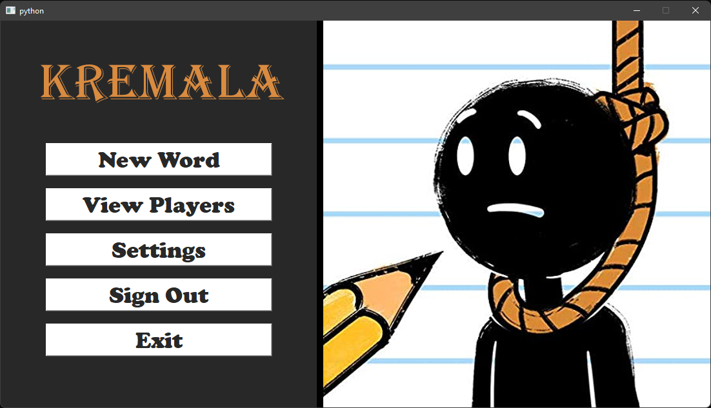

# ***Greek HangMan***



### *Table of Contents*

- [Description](#description)
- [School Assigment](#school-assigment)
- [How To Use](#how-to-use)
- [Game Explanation](#explain-the-game)

---

## ***Description***

This project was a school assigment ([School Assigment](#school-assigment)). I had 2-3 months to learn and create an application like the hangman game. For this project i used `Python` in the Visual Studio 2019 and i "cheated" by not creating all the UI by my self but instead i used `Qt Design` for a fast and visually better work!

#### *What i learned in the procces:*

- Python
- Qt Design
- SQLite

---
## ***School Assigment***

#### *Visual Programming - Hangman Assignment*

##### You have to create an application with the following parts:
1. Implement a Sqlite database for the application. The following tables should be in the database:
   - `Player` with player name and number of answers.
   - `Word` with the word and the category of the word (eg IOANNINA, GEOGRAPHY).
2. Player entry dialog. At the start of the application, the user is asked to enter his password. If the password does not exist in the database it is created automatically.
3. Mainly application. After logging in, a new window with press keys for the following options appears:
   - `New Word`. With this key a new game starts and the previous one is canceled. The user should be able to select a word category.
   - `Letter Selection`. Pressing the key should display a letter input dialog for the current word.
   - `Appearance of players`. Display the names of all the players and the score of each of them.

---

## ***How To Use***

#### *Installation*

You must have downloaded Visual Studio 2019 for the Installation to succeed!

- Step 1: Download the zip file from my github.
- Step 2: Unzip the file and copy only the folder `Hangman` to a desired location.
- Step 3: Open cmd and type this:
```html   
pip install PyQt5
pip install pyqt5-tools
```
- Step 4: Go to ``` *Hangman-file-location*\Hangman\Hangman.lsn ``` and double click it. This will open the Visual Studio 2019.
- Step 5: In the Visual Studio 2019 go to ``` View > Other Windows > Python Environments menu command. ``` On the right there will be a dropbox that says "Overview" select "Packages (PyPi)" and then enter the name of the file `pygame` and download the default install.
- Step 6: Thats it!! 😃 Now you can press the green play button on the middle top of the screen and play!

[Back To The Top](#greek-hangman)

---

## ***Explain the game***

Comming soon ...


[Back To The Top](#greek-hangman)

---
